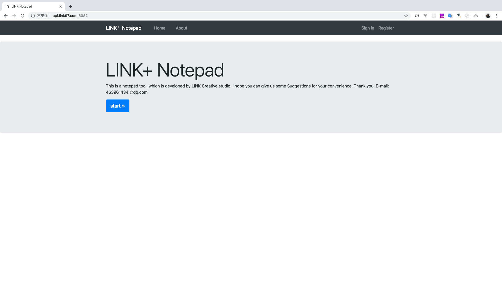
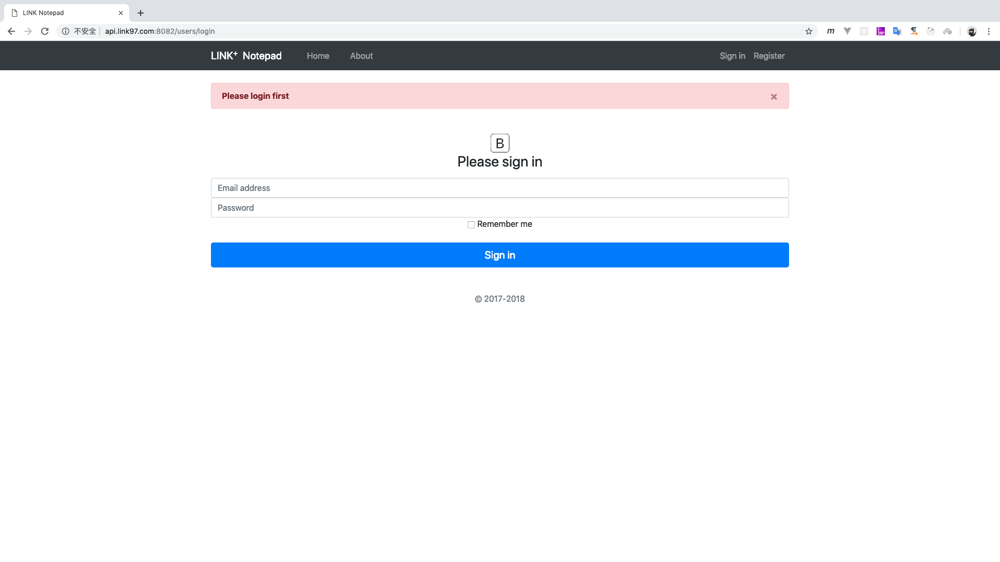
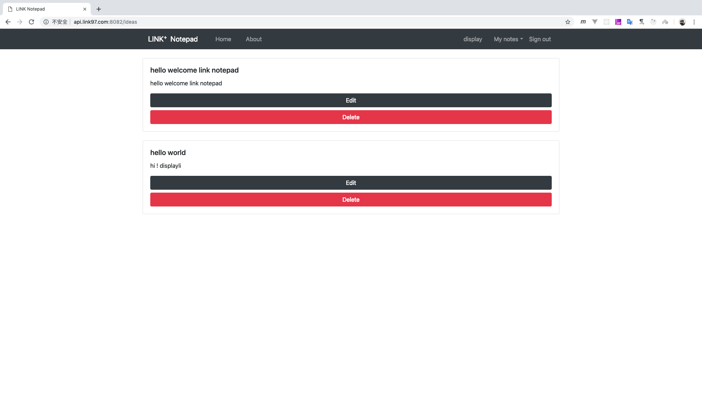
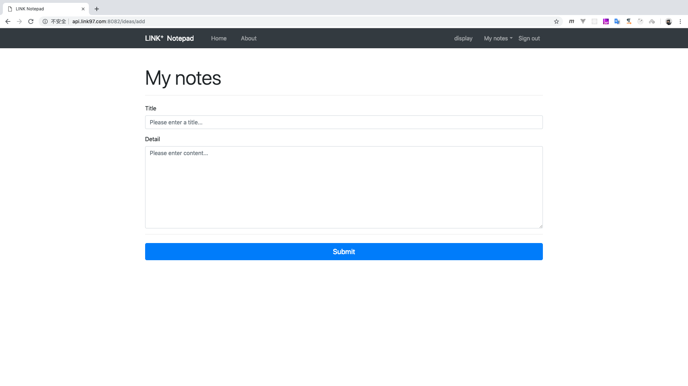

# 个人记事本项目

## web applicaion


> UI







> files

```
        .
        ├── NavIntercept
        │   └── navIntercept.js
        ├── README.md
        ├── app.js
        ├── config
        │   └── passport.js
        ├── lookImg
        │   ├── 1.png
        │   ├── 2.png
        │   ├── 3.png
        │   ├── 4.png
        │   └── 5.png
        ├── model
        │   ├── Model.js
        │   └── Users.js
        ├── package-lock.json
        ├── package.json
        ├── public
        │   └── css
        │       └── style.styl
        ├── routes
        │   ├── ideas.js
        │   └── users.js
        └── views
        ├── about.handlebars
        ├── home.handlebars
        ├── ideas
        │   ├── add.handlebars
        │   ├── edit.handlebars
        │   └── ideas.handlebars
        ├── layouts
        │   └── main.handlebars
        ├── partials
        │   ├── _error.handlebars
        │   ├── _msg.handlebars
        │   └── _navbar.handlebars
        └── users
                ├── login.handlebars
                └── register.handlebars

        12 directories, 27 files

```

[Click Go Demos](http://api.link97.com:8082 "Click Go Demos")

Copy right displayli 转载请加备注 或 联系 QQ：463961434

Author By displayLi @ [LINK+ 创意工作室 ](http://www.link97.com "LINK Create Studio")
